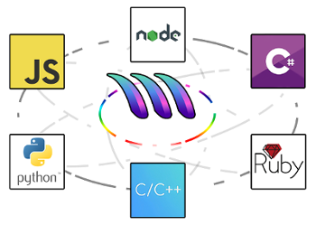

Introduction
===============

MetaCall allows calling functions, methods or procedures between multiple programming languages.

sum.py

.. code-block:: python

     def sum(a, b):
         return a + b

main.js

.. code-block:: javascript

    const { sum } = require('./sum.py');

    sum(3, 4); // 7

.. _different_port:

shell

.. code-block:: bash

    metacall main.js

Use the :ref:`installer<installation>` and try some :ref:`examples<examples>`.
